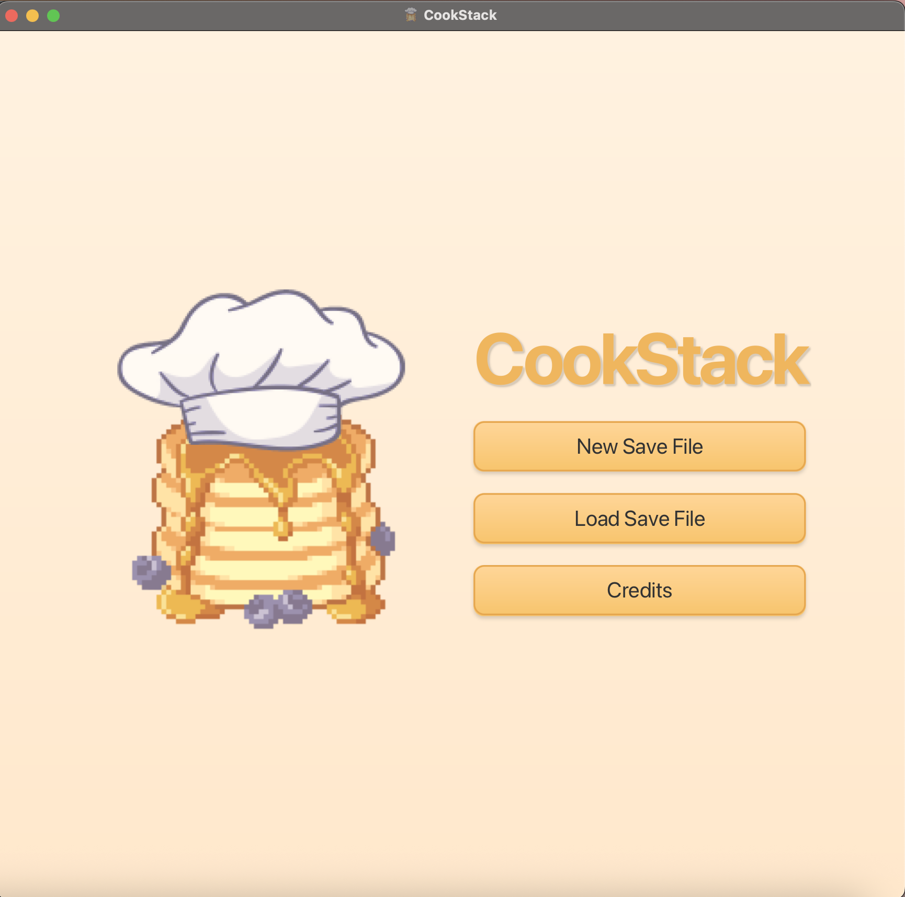
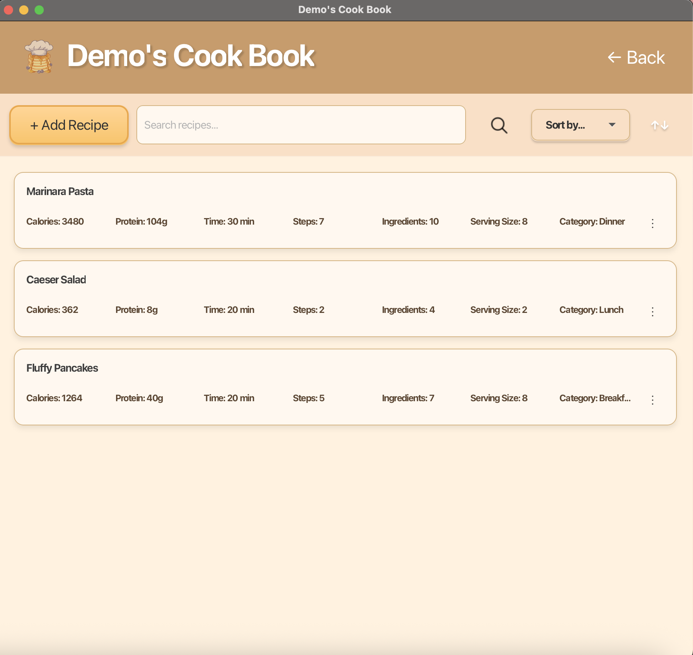
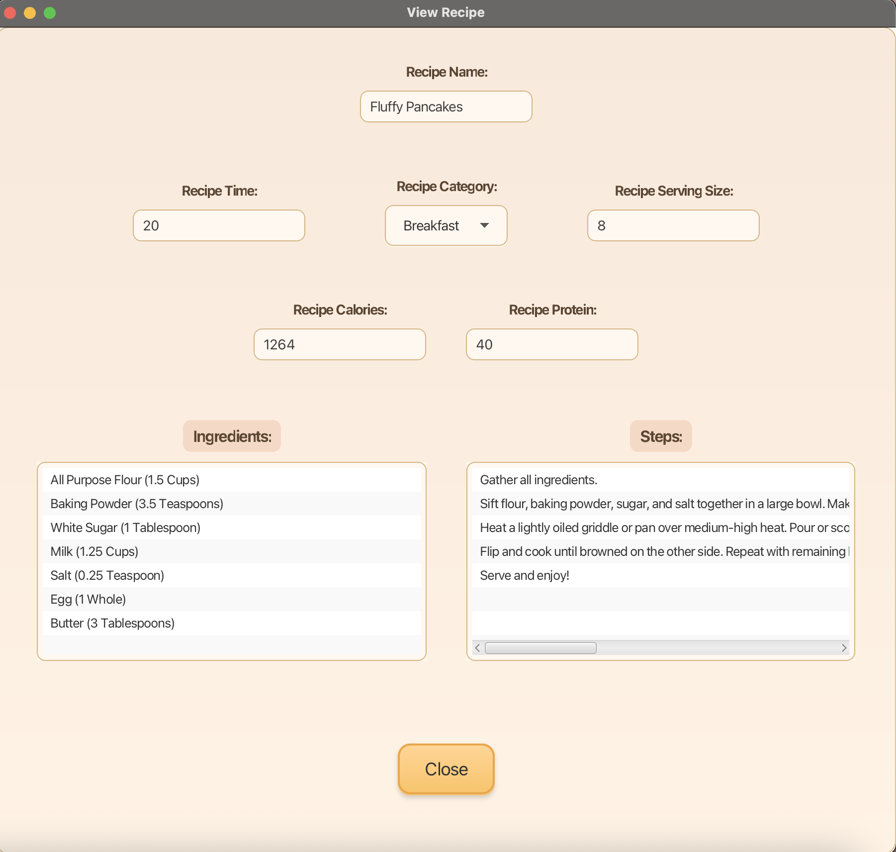

# 🍳 CookStack

CookStack is a JavaFX/Java app that helps you organize, save, and explore all your favorite recipes!

---

## ✨ Features

- 🆕 **Create New Recipe Files** – Start fresh and save your culinary masterpieces.
- 📂 **Load Existing Recipes** – Bring back all your tried-and-true recipes in a flash!
- 🎨 **Sleek Animated UI** – Buttons, logos, and titles that pop with animations.
- 👩‍🍳 **Credits Section** – See who made the magic happen behind the scenes.

---

## 📸 Screenshots

### Main Menu



### Recipe List



### Recipe Viewer



---

## 🌟 Planned Features

Here’s what’s cooking for future versions of CookStack:

- 🍽️ **Recipe Categories & Filters** – Tag recipes as *breakfast*, *lunch*, or *dinner*, and filter them easily.
- 🔗 **Recipe Sharing** – Find a way to share your recipes with friends and family!
- 🖼️ **Recipe Images** – Add a picture to every recipe!

---

## 🏆 Demo

I've included a **sample save file** so you can jump right in and test it out! All recipes are from allrecipes.com.

```
demo/demo.ser
```

There’s also a **walkthrough video** on YouTube:

[](https://www.youtube.com/watch?v=53fJrpb1jpQ)

[YouTube video link](https://www.youtube.com/watch?v=53fJrpb1jpQ)

> ⚠️ Heads up! Serialized files are tied to the exact class/package setup. Changing package names might break old files.

---

## 🚀 How to Run CookStack on Another Laptop

Before running the app, make sure the laptop has:

- **Git**
- **Java JDK 24+**

You do **not** need to install Maven separately because this project includes the Maven wrapper.

1. Fork this repo on GitHub.

2. Clone your fork:

```bash
git clone https://github.com/YOUR-USERNAME/CookStack.git
```

If you do not want to fork it, you can clone the original repo instead:

```bash
git clone https://github.com/LaraGouda/CookStack.git
```

3. Go into the project folder:

```bash
cd CookStack
```

4. Run the app.

On Mac or Linux:

```bash
./mvnw javafx:run
```

On Windows:

```bash
mvnw.cmd javafx:run
```

If Mac or Linux says `permission denied`, run this once:

```bash
chmod +x mvnw
```

Then try again:

```bash
./mvnw javafx:run
```

---

## 📂 Project Structure

```
CookStack/
├─ docs/images/           # README screenshots
├─ src/main/java/app/cookstack/...
├─ src/main/resources/
│   ├─ images/
│   └─ styles/
├─ demo/                  # Fun demo save files
├─ README.md
├─ pom.xml
└─ .gitignore
```

---

## Credits

- **Author:** Lara Gouda
- **Icons & Images:** Freepik, Retropi
- **Demo Recipes:** allRecipes.com

---

## License

All rights reserved. Please don’t copy or redistribute without permission, but feel free to fork and play with your own recipes! 🥳
